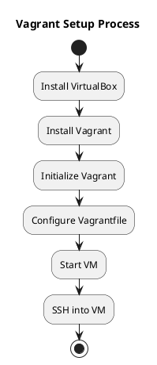
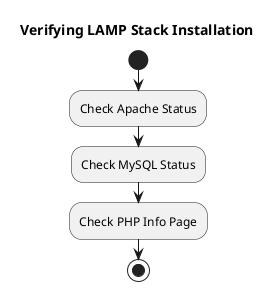

# **Ebook 1: Comprehensive Guide to Setting Up the LAMP Stack and Local Practice Environment**

---

## **Introduction**

Welcome to the world of web development! This ebook is your gateway to setting up a powerful and versatile local development environment using the LAMP stack on Ubuntu 20.04. Whether you're just stepping into the realm of coding or looking to polish your skills, this guide will take you through the essentials of creating a local server environment. By the end of this guide, you'll be equipped to develop and test dynamic web applications right from your own machine.

---

## **Chapter 1: Setting Up the Environment**

### **1.1 Introduction to Virtual Machines and Vagrant**

Imagine having a mini-computer inside your computer. That’s essentially what a virtual machine (VM) is—it’s a self-contained environment that runs an operating system and applications just like a physical computer, but it’s all virtual. VirtualBox provides the platform to run these virtual machines, while Vagrant manages and configures them. 

**Why Use Virtual Machines?**

Virtual machines are crucial for development because they offer:

- **Isolation**: Develop and test applications in a contained environment that doesn’t affect your main system.
- **Consistency**: Ensure that your development setup is consistent across different team members or projects, eliminating environment-related issues.
- **Flexibility**: Easily switch between different configurations and test various environments without changing your main system setup.

**Getting Started with Vagrant**

1. **Install VirtualBox:**

VirtualBox is the tool that creates and runs your virtual machines. To start:

- Visit [VirtualBox's official website](https://www.virtualbox.org/) and download the version compatible with your operating system.
- Follow the installation instructions to set it up on your computer.

*Screenshot Placeholder:*


*Caption:* “The VirtualBox installation wizard, guiding you through setting up VirtualBox on your computer.”

2. **Install Vagrant:**

Vagrant makes managing your virtual machines easier. Download it from [Vagrant's official site](https://www.vagrantup.com/), and follow the installation guide for your operating system.

*Screenshot Placeholder:*


*Caption:* “The Vagrant installation process, preparing your system to manage virtual environments.”

3. **Initialize and Configure Your Vagrant Box:**

With Vagrant installed, it’s time to set up your virtual environment:

- Open your terminal and navigate to the folder where you want your Vagrant project to be. This is where your virtual machine’s configuration will be stored.

    ```bash
    mkdir my-lamp-environment
    cd my-lamp-environment
    ```

- Initialize Vagrant in this directory, which creates a `Vagrantfile` that contains configuration details for your VM.

    ```bash
    vagrant init
    ```

- Open the `Vagrantfile` in a text editor and update it to use Ubuntu 18.04, which is compatible with Ubuntu 20.04. Your file should look like this:

    ```ruby
    Vagrant.configure("2") do |config|
      config.vm.box = "ubuntu/bionic64"
    end
    ```

- Start your VM with:

    ```bash
    vagrant up
    ```

- Connect to your VM using SSH:

    ```bash
    vagrant ssh
    ```

*PlantUML Diagram:*



*Caption:* “Diagram illustrating the step-by-step process of setting up and starting a Vagrant virtual environment.”

---

## **Chapter 2: Installing the LAMP Stack**

### **2.1 Installing Linux (Ubuntu 20.04)**

Ubuntu is the operating system that will host your web server. Since your Vagrant box is already running Ubuntu, you don’t need to install it from scratch. However, keeping your system up-to-date is crucial. 

**Updating Your System:**

To ensure you have the latest security patches and software updates, run:

```bash
sudo apt update
sudo apt upgrade
```

*Screenshot Placeholder:*


*Caption:* “Terminal screenshot showing the commands to update and upgrade Ubuntu.”

### **2.2 Installing Apache**

Apache is a popular web server software that will handle incoming web requests and serve your web pages.

**Installation Steps:**

1. To install Apache, use the following command:

    ```bash
    sudo apt install apache2
    ```

2. Once installed, you need to start the Apache service and ensure it starts automatically on boot:

    ```bash
    sudo systemctl start apache2
    sudo systemctl enable apache2
    ```

3. To verify that Apache is running correctly, open your web browser and go to `http://localhost`. You should see the Apache default page, which confirms that Apache is up and running.

*Screenshot Placeholder:*


*Caption:* “The default Apache page displayed in your browser, indicating that Apache is correctly installed.”

### **2.3 Installing MySQL**

MySQL is the database system that will store your web application data.

**Installation Steps:**

1. Install MySQL with the following command:

    ```bash
    sudo apt install mysql-server
    ```

2. After installation, secure your MySQL server by running:

    ```bash
    sudo mysql_secure_installation
    ```

   Follow the prompts to set a root password and remove insecure default settings.

3. To check if MySQL is working, log into the MySQL command line:

    ```bash
    sudo mysql
    ```

*Screenshot Placeholder:*


*Caption:* “MySQL command-line interface after logging in, confirming MySQL is operational.”

### **2.4 Installing PHP**

PHP is a scripting language that will generate dynamic content for your web pages.

**Installation Steps:**

1. Install PHP and the necessary module for Apache:

    ```bash
    sudo apt install php libapache2-mod-php php-mysql
    ```

2. To confirm PHP is integrated with Apache, create a PHP info file:

    ```bash
    sudo nano /var/www/html/info.php
    ```

   Add the following code to the file:

    ```php
    <?php
    phpinfo();
    ?>
    ```

   Save the file and close the editor. Visit `http://localhost/info.php` in your web browser to see the PHP configuration details.

*Screenshot Placeholder:*


*Caption:* “The PHP info page displayed in your browser, showing PHP is correctly installed and configured.”

---

## **Chapter 3: Verifying the Installation**

**Ensuring Everything is Running:**

To confirm that Apache, MySQL, and PHP are all working correctly:

- **Check Apache Status:**

    ```bash
    sudo systemctl status apache2
    ```

- **Check MySQL Status:**

    ```bash
    sudo systemctl status mysql
    ```

- **Verify PHP Functionality:** Visit `http://localhost/info.php` to ensure PHP is correctly set up.

*PlantUML Diagram:*



*Caption:* “Diagram showing the verification steps to ensure the LAMP stack components are functioning correctly.”

---

## **Chapter 4: Working with the LAMP Stack**

### **4.1 Creating and Hosting Simple Web Applications**

**Creating a Static Web Page:**

Navigate to the web root directory where your web files are stored:

```bash
cd /var/www/html
```

Create a new HTML file named `index.html`:

```bash
sudo nano index.html
```

Add the following content to create a simple web page:

```html
<html>
<head>
    <title>My First LAMP Page</title>
</head>
<body>
    <h1>Welcome to My LAMP Server!</h1>
    <p>This is a simple HTML page served by Apache.</p>
</body>
</html>
```

Save the file and close the editor. Visit `http://localhost` to see your newly created page.

**Developing a PHP Application:**

Create a PHP file named `myapp.php`:

```bash
sudo nano myapp.php
```

Add the following PHP code:

```php
<?php
echo "<h1>Hello from PHP!</h1>";
?>
```

Save and close the file. Visit `http://localhost/myapp.php` to see the output of your PHP script.

*Screenshot Placeholder:*


*Caption:* “Creating and testing HTML and PHP files in the web root directory.”

### **4.2 Basic Server Maintenance**

**Keeping Your System Updated:**

Regular updates ensure that your server has the latest security patches and improvements.

 To update your system, run:

```bash
sudo apt update
sudo apt upgrade
```

**Backing Up Your Data:**

Regular backups are essential to protect your data. You can use tools like `rsync` or `tar` to create backups of your web files and databases. 

For a basic backup of your web directory:

```bash
sudo tar -czvf backup.tar.gz /var/www/html
```

---

## **Conclusion**

Congratulations! You've successfully set up a LAMP stack on your local machine. This environment is now ready for you to start developing and testing web applications. 

In the next ebook, we’ll dive deeper into Linux commands and terminal navigation, enhancing your ability to interact with and manage your development environment effectively.

**Additional Resources:**

- [Vagrant Documentation](https://www.vagrantup.com/docs)
- [Apache Documentation](https://httpd.apache.org/docs/)
- [MySQL Documentation](https://dev.mysql.com/doc/)
- [PHP Documentation](https://www.php.net/docs.php)
