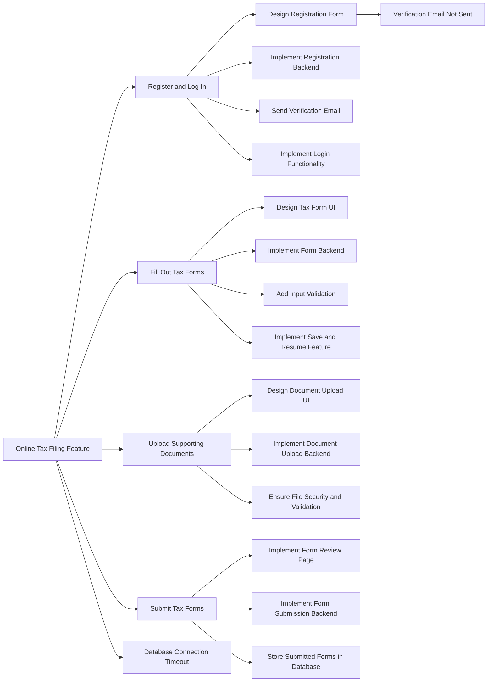

# Hands-On: Sample Azure DevOps Work Items - Government Portal

## Epic: Online Tax Filing Feature

**Title:** Online Tax Filing Features

**Description:**
Develop an online tax filing feature that allows citizens to submit their tax returns electronically through the government portal. This feature should include user authentication, form filling, document upload, and submission functionalities.

**Acceptance Criteria:**

1. Users should be able to register and log in.
2. The system should allow users to fill out tax forms electronically.
3. Users should be able to upload supporting documents.
4. Submitted forms should be stored in the government database.

**Business Value:**
Improves the efficiency of tax submissions and reduces paperwork.

**Estimated Effort:** 100 Story Points

**Related Work Items:**

- User Stories: Register and Log In, Fill Out Tax Forms, Upload Supporting Documents, Submit Tax Forms

---

## User Story: Register and Log In

**Title:** Register and Log In

**As a** citizen,
**I want** to register and log in to the portal,
**So that** I can access the online tax filing feature.

**Acceptance Criteria:**

1. The registration form must collect the user's name, email, and password.
2. The system must send a verification email upon successful registration.
3. Users must be able to log in using their email and password.

**Story Points:** 8

**Tasks:**

- Design Registration Form
- Implement Registration Backend
- Send Verification Email
- Implement Login Functionality

### Task: Design Registration Form

**Title:** Design Registration Form

**Description:**
Create a design for the registration form that includes fields for the user's name, email, and password. Ensure the design is responsive and user-friendly.

**Acceptance Criteria:**

1. The registration form should have fields for name, email, and password.
2. The design should be responsive and work on mobile and desktop devices.
3. The submit button should be clearly visible and styled according to the portal theme.

**Assigned To:** Jane Doe

**Due Date:** 2024-07-15

**Effort:** 4 hours

---

### Task: Implement Registration Backend

**Title:** Implement Registration Backend

**Description:**
Develop the backend functionality to handle user registration, including saving user details to the database and sending verification emails.

**Acceptance Criteria:**

1. User details should be stored securely in the database.
2. A verification email should be sent upon successful registration.

**Assigned To:** John Smith

**Due Date:** 2024-07-17

**Effort:** 8 hours

### Task: Send Verification Email

**Title:** Send Verification Email

**Description:**
Implement the functionality to send a verification email to users after they complete the registration process.

**Acceptance Criteria:**

1. Users should receive a verification email upon successful registration.
2. The email should contain a verification link to activate the user account.

**Assigned To:** Mary Johnson

**Due Date:** 2024-07-18

**Effort:** 4 hours

### Task: Implement Login Functionality

**Title:** Implement Login Functionality

**Description:**
Develop the functionality to allow users to log in to the portal using their email and password.

**Acceptance Criteria:**

1. Users should be able to log in using their email and password.
2. The system should verify the user's credentials and grant access to the portal.

**Assigned To:** Jane Doe

**Due Date:** 2024-07-19

**Effort:** 6 hours

### Bug: Verification Email Not Sent

**Title:** Verification Email Not Sent

**Description:**
The verification email is not being sent after a user registers on the portal.

**Steps to Reproduce:**

1. Open the registration page.
2. Fill in the registration form with valid details.
3. Submit the form.

**Expected Result:**
The system should send a verification email to the user's email address.

**Actual Result:**
No verification email is sent.

**Severity:** High

**Assigned To:** John Smith

**Status:** Open

---

## User Story: Fill Out Tax Forms

**Title:** Fill Out Tax Forms

**As a** citizen,
**I want** to fill out my tax forms online,
**So that** I can submit my tax return electronically.

**Acceptance Criteria:**
1. The tax forms should be available online.
2. Users should be able to save their progress and return later.
3. The form should validate input to ensure accuracy.

**Story Points:** 10

**Tasks:**
- Design Tax Form UI
- Implement Form Backend
- Add Input Validation
- Implement Save and Resume Feature

---

## User Story: Upload Supporting Documents

**Title:** Upload Supporting Documents

**As a** citizen,
**I want** to upload supporting documents,
**So that** I can provide the necessary documentation for my tax return.

**Acceptance Criteria:**
1. Users should be able to upload multiple documents.
2. The system should accept common file formats (e.g., PDF, JPG).
3. Uploaded documents should be stored securely.

**Story Points:** 5

**Tasks:**
- Design Document Upload UI
- Implement Document Upload Backend
- Ensure File Security and Validation

---

## User Story: Submit Tax Forms

**Title:** Submit Tax Forms

**As a** citizen,
**I want** to submit my completed tax forms,
**So that** my tax return can be processed by the government.

**Acceptance Criteria:**
1. Users should be able to review their tax forms before submission.
2. The system should confirm the successful submission.
3. Submitted forms should be stored in the government database.

**Story Points:** 8

**Tasks:**
- Implement Form Review Page
- Implement Form Submission Backend
- Store Submitted Forms in Database

---

## Issue: Database Connection Timeout

**Title:** Database Connection Timeout

**Description:**
The database connection times out during peak hours, causing slow response times and occasional failures.

**Impact:**
This issue affects the user experience by causing delays and potential data loss during peak usage times.

**Root Cause:**
The database server is unable to handle the increased load during peak hours due to insufficient resources.

**Resolution Plan:**
1. Upgrade the database server to a higher capacity.
2. Optimize database queries to reduce load.
3. Implement connection pooling to manage database connections more efficiently.

**Assigned To:** Sarah Lee

**Due Date:** 2024-07-20

**Status:** In Progress

---

## Mermaid Diagram for Use Cases

To visualize the relationships between the Epic, User Stories, Tasks, Bugs, and Issues, here is a sample Mermaid diagram:

This diagram shows the hierarchy and flow of work items, helping your team visualize the project's structure and dependencies.
