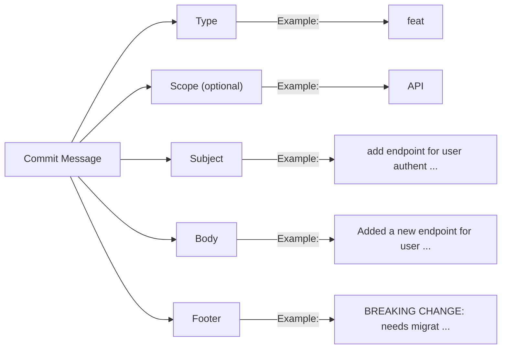

# Understanding Git Conventional Commits

Git conventional commits are a standardized way of writing commit messages that make them more readable and meaningful. This convention improves collaboration and communication within a team by providing a clear structure and format for commit messages. It also aids in automating processes like generating changelogs and determining the impact of changes.

## Components of a Conventional Commit

A conventional commit message consists of several components:

1. **Type**: Specifies the nature of the commit.
2. **Scope**: Optional component that specifies the part of the codebase affected by the commit.
3. **Subject**: A brief summary of the commit.
4. **Body**: Provides a detailed description of the commit.
5. **Footer**: Contains additional information like breaking changes or issue references.

Here's a detailed breakdown:

- **Type**: The type indicates the purpose of the commit. Common types include:
  - `feat`: A new feature
  - `fix`: A bug fix
  - `docs`: Documentation changes
  - `style`: Code style changes (e.g., formatting)
  - `refactor`: Code refactoring
  - `test`: Adding or updating tests
  - `chore`: Maintenance tasks

- **Scope**: The scope is optional and provides context about the part of the codebase affected by the commit. For example, if the commit affects the user authentication module, the scope might be `auth`. Common scopes include:
  - `api`: Changes to the API layer
  - `ui`: Changes to the user interface
  - `backend`: Backend system changes
  - `database`: Changes to the database schema or queries
  - `auth`: Authentication-related changes
  - `ci`: Changes to the continuous integration configuration
  - `deps`: Changes to dependencies

- **Subject**: The subject is a short, imperative sentence that summarizes the change. It should be concise and descriptive, no more than 50 characters.

- **Body**: The body provides a more detailed explanation of the changes. It can include the motivation for the change, what was changed, and any relevant background information. It's separated from the subject by a blank line.

- **Footer**: The footer is used for any additional information. This can include breaking changes or references to issues or pull requests. Breaking changes should be prefixed with `BREAKING CHANGE:`.Common footers include:
  - `BREAKING CHANGE`: Describes a breaking API change.
  - `Closes`: References the issue that the commit addresses.


A conventional commit message consists of the following structure:

```
    <type>(scope): <description>
    [body]
    [footer]
```

**Adding an api feature conventional commit message:**

```
    feat(API): add endpoint for user authentication
    Added a new endpoint for user authentication, allowing clients to request authentication tokens.
    BREAKING CHANGE: needs migration to work
```



## Hands-On Practical: Conventional Commit Components

This practical guide will walk through the steps to practice all components of conventional commits. We'll initialize a Git repository, make several commits using the conventional commit format, generate a changelog, and automate release management.

### Step 1: Initialize a Git Repository

1. **Create a New Directory for the Project**:

   ```sh
   mkdir my-conventional-commits-project
   cd my-conventional-commits-project
   ```

2. **Initialize a Git Repository**:

   ```sh
   git init
   ```

### Step 2: Create Initial Files

1. **Create a `README.md` File**:

   ```sh
   echo "# My Conventional Commits Practical" > README.md
   ```

2. **Create an Initial JavaScript File**:

   ```sh
   echo "console.log('Hello, world!');" > index.js
   ```

3. **Stage and Commit the Initial Files**:

   ```sh
   git add README.md index.js
   git commit -m "docs: add initial README and index.js"
   ```

### Step 3: Make Conventional Commits

1. **Add a New Feature**:

   ```sh
   echo "function greet() { console.log('Hello, user!'); }" >> index.js
   git add index.js
   git commit -m "feat: add greet function"
   ```

2. **Fix a Bug**:
   Modify the `greet` function to fix a typo:

   ```sh
   sed -i '' 's/Hello, user!/Hello, world!/' index.js
   git add index.js
   git commit -m "fix: correct greeting message in greet function"
   ```

3. **Update Documentation**:

   ```sh
   echo "## Usage\n\nRun \`node index.js\` to see the output." >> README.md
   git add README.md
   git commit -m "docs: add usage instructions to README"
   ```

4. **Refactor Code**:
   Refactor the `greet` function to improve readability:

   ```sh
   echo "function greetUser() { console.log('Hello, world!'); }" > index.js
   git add index.js
   git commit -m "refactor: rename greet function to greetUser"
   ```

5. **Style Changes**:
   Format the `index.js` file:

   ```sh
   echo "function greetUser() { console.log('Hello, world!'); }" > index.js
   git add index.js
   git commit -m "style: format index.js"
   ```

6. **Add Tests**:
   Create a test file:

   ```sh
   echo "console.log('Running tests...');" > test.js
   git add test.js
   git commit -m "test: add initial tests"
   ```

7. **Chore Task**:
   Update the `.gitignore` file:

   ```sh
   echo "node_modules/" > .gitignore
   git add .gitignore
   git commit -m "chore: add node_modules to .gitignore"
   ```

8. **Breaking Change**:
   Modify the `greetUser` function:

   ```sh
   echo "function greetUser(name) { console.log(\`Hello, \${name}!\`); }" > index.js
   git add index.js
   git commit -m "feat: modify greetUser to accept a name argument\n\nBREAKING CHANGE: greetUser now requires a name argument"
   ```

### Step 4: Generate Changelog

1. **Install Standard Version**:

   ```sh
   npm install -g standard-version
   ```

2. **Generate the Changelog**:

   ```sh
   standard-version
   ```

   This command will create or update the `CHANGELOG.md` file with the categorized changes based on the commit messages.

### Step 5: Automate Release Management

1. **Install Semantic Release**:

   ```sh
   npm install -g semantic-release
   ```

2. **Configure Semantic Release**:
   Create a `.releaserc` file in the project root with the necessary plugins:

   ```json
   {
     "branches": ["main"],
     "plugins": [
       "@semantic-release/commit-analyzer",
       "@semantic-release/release-notes-generator",
       "@semantic-release/changelog",
       "@semantic-release/github",
       "@semantic-release/git"
     ]
   }
   ```

3. **Run Semantic Release**:

   ```sh
   npx semantic-release
   ```

## Hands-On Practice: All Commit Types

1. **Feature Addition**:

   ```sh
   git checkout -b feat/add-welcome-message
   echo "Welcome to the team!" > welcome.txt
   git add welcome.txt
   git commit -m "feat(ui): add welcome message to welcome.txt"
   git push origin feat/add-welcome-message
   ```

2. **Bug Fix**:

   ```sh
   git checkout -b fix/fix-typo
   echo "Hello, World!" > greeting.txt
   git add greeting.txt
   git commit -m "fix(ui): fix typo in greeting message"
   git push origin fix/fix-typo
   ```

3. **Documentation**:

   ```sh
   git checkout -b docs/update-readme
   echo "Installation Instructions" > README.md
   git add README.md
   git commit -m "docs(readme): update installation instructions"
   git push origin docs/update-readme
   ```

4. **Refactor**:

   ```sh
   git checkout -b refactor/optimize-greeting
   echo "Hi, Team!" > greeting.txt
   git add greeting.txt
   git commit -m "refactor(backend): optimize greeting message logic"
   git push origin refactor/optimize-greeting
   ```

5. **Style**:

   ```sh
   git checkout -b style/reformat-code
   echo "Hello, World!" > greeting.txt
   git add greeting.txt
   git commit -m "style(auth): reformat greeting message code"
   git push origin style/reformat-code
   ```

6. **Performance**:

   ```sh
   git checkout -b perf/improve-query
   echo "Optimized Query" > query.sql
   git add query.sql
   git commit -m "perf(database): improve query execution time"
   git push origin perf/improve-query
   ```

7. **Test**:

   ```sh
   git checkout -b test/add-unit-tests
   echo "Test for greeting message" > test_greeting.txt
   git add test_greeting.txt
   git commit -m "test(api): add unit tests for greeting message"
   git push origin test/add-unit-tests
   ```

8. **Chore**:

   ```sh
   git checkout -b chore/update-dependencies
   echo "Updated dependencies" > dependencies.txt
   git add dependencies.txt
   git commit -m "chore(deps): update dependency versions"
   git push origin chore/update-dependencies
   ```


This command analyzes the commit messages, determines the next version, updates the changelog, and creates a new release on GitHub.

## Reference Links

- [Conventional Commits Specification](https://www.conventionalcommits.org/en/v1.0.0/)
- [Standard Version](https://github.com/conventional-changelog/standard-version)
- [Semantic Release](https://github.com/semantic-release/semantic-release)
- [Angular Commit Message Guidelines](https://github.com/angular/angular/blob/main/CONTRIBUTING.md#commit)

